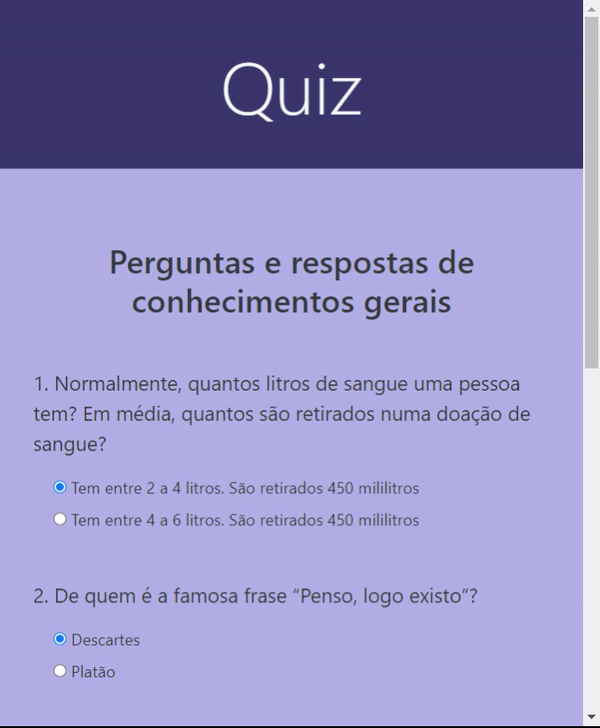

<h1 align="center">Quiz</h1>

  <a href="#-app">Aplicação</a>   | 
  <a href="#tecnologias">Tecnologias</a>   |   
  <a href="#-page">Page</a>   
  

  

     

## ❓ App

> Quiz com perguntas e respostas sobre conhecimentos gerais. 

## 🚀 Tecnologias

- **HTML**

- **Bootstrap**

- **JavaScript**
  
  

## 🔖 Page

- Você pode visualizar o resultado final do projeto através [desse link]([https://www.figma.com/file/Byw4X5etg8VCmezueyhzkC/Ecoleta-(Starter)?node-id=136%3A546](https://angelicacamp.github.io/quiz-app/)).

---

Feito com ♥ by Angélica C.
